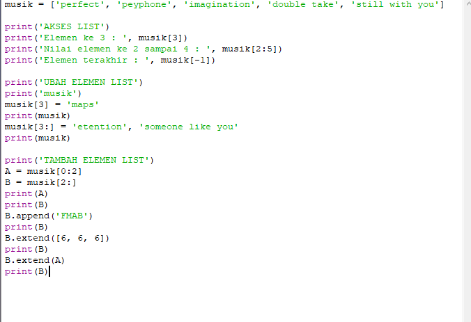
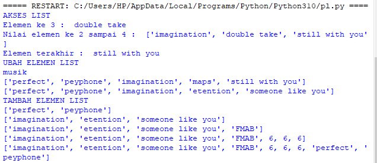
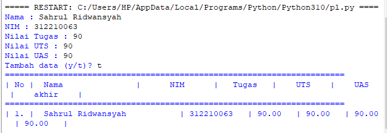
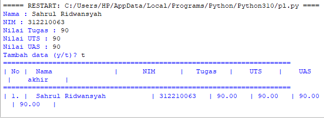

# latihan 1

-masukan list disini saya ambil 5 dan temanya musik 
-lalu enter dan akses list yang ada di kodingan sebelumnya
-enter lagi dan masukan list 3
-lanjut lagi masukan elemen 2 sampai 4
-lalu maukan elemen terakhir
-ubah elemen list
-masukan elemen ke 4 dengan elemen lainnya
-masukan elemen ke 4 sampai dengan elemen terakhir
-lalu tambah elemen list
-ambil 2 bagian dari list pertama (A) danjadikan list 2 (B)
-masukan list B dengan nilai string
-masukan list B dengan 3 elemen
-satukan list B dengan list A
contohnya seperti di gambar berikut

lalu running dan hasilnya seperti gambar di bawah:

# latihan 2

membuat program sederhana untuk menambahkan data dalam sebuah list

- Progam meminta memasukkan data sebanyak-banyaknya (gunakan perulangan)
- Tampilkan pertanyaan untuk menambah data (y/t?), apabila jawaban t (Tidak), maka program akan menampilkan daftar datanya. 
- Nilai Akhir diambil dari perhitungan 3 komponen nilai (tugas: 90, uts: 90, uas: 90%)
contohny seperti gambar berikut

lalu hasil runninganya seperti gambar dibawah

# flowchart tentang penjelasan program

